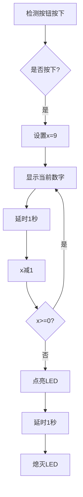

Arduino 倒计时器程序详解（就像一个定时炸弹一样）

本实验目标：按钮控制一位数码管倒计时，并在倒计时结束后执行某些动作

目标分析：为了完成这个实验，我们首先对于它进行架构的分析

传感器：按钮
控制器：UNO/ESP32
执行器：一位数码管，LED灯/蜂鸣器/某某

接着是效果分析：

有一个按钮，按下后数码管会开始倒计时，从九到零进行倒计时，在倒计时结束后执行某些动作。

明确目标系统与效果，开始正式学习---

## 代码全貌
```arduino
volatile int x; // 全局变量，存储当前倒计时数值

void 数码管显示数字(int x) { /* 数码管段码控制 */ }

void setup(){
  x = 0; // 初始化数值
  pinMode(12, INPUT_PULLUP); // 按钮引脚配置
  // 数码管引脚配置
  pinMode(4, OUTPUT); // 段a
  pinMode(5, OUTPUT); // 段b
  pinMode(6, OUTPUT); // 段c
  pinMode(7, OUTPUT); // 段d
  pinMode(9, OUTPUT); // 段e
  pinMode(10, OUTPUT);// 段f
  pinMode(11, OUTPUT);// 段g
  pinMode(3, OUTPUT); // LED引脚
}

void loop(){
  if (!digitalRead(12)) { // 检测按钮按下
    x = 9; // 设置初始值
    while (x >= 0) { // 倒计时循环
      数码管显示数字(x); // 显示数字
      delay(1000); // 保持1秒
      x--; // 数值减1
    }
    digitalWrite(3,HIGH); // 点亮LED/蜂鸣器
    delay(1000); // 保持1秒
    digitalWrite(3,LOW); // 熄灭LED/蜂鸣器
  }
}
```

---

## 核心概念解析

### 1. 七段数码管工作原理
| 段名 | 引脚 | 功能描述 | 数字0时的状态       |
| ---- | ---- | -------- | ------------------- |
| a    | 4    | 顶部横段 | HIGH                |
| b    | 5    | 右上竖段 | HIGH                |
| c    | 6    | 右下竖段 | HIGH                |
| d    | 7    | 底部横段 | LOW（应修正为HIGH） |
| e    | 9    | 左下竖段 | HIGH                |
| f    | 10   | 左上竖段 | HIGH                |
| g    | 11   | 中间横段 | HIGH（应修正为LOW） |

### 2. 按钮检测机制
```c
pinMode(12, INPUT_PULLUP); // 启用内部上拉电阻
```
- **上拉电阻作用**：
  - 按钮未按下时：引脚电压保持HIGH（5V）
  - 按钮按下时：引脚接地变为LOW（0V）
- **逻辑判断**：
  `!digitalRead(12)`等效于`digitalRead(12) == LOW`

### 3. 倒计时逻辑流程


---

## 代码逐行详解

### 1. 数码管显示函数
```arduino
void 数码管显示数字(int x) {
  if (x == 0) {
    digitalWrite(4,HIGH); // a段亮
    digitalWrite(5,HIGH); // b段亮
    digitalWrite(6,HIGH); // c段亮
    digitalWrite(7,LOW);  // d段灭
    // ...其他段类似
  }
  // 其他数字判断...
}
```
```arduino
// 标准共阴数码管段码（0的显示）
digitalWrite(4, HIGH); // a
digitalWrite(5, HIGH); // b
digitalWrite(6, HIGH); // c
digitalWrite(7, HIGH); // d
digitalWrite(9, HIGH); // e
digitalWrite(10,HIGH); // f
digitalWrite(11, LOW); // g
```

### 2. 初始化函数（setup）
```arduino
void setup(){
  x = 0; // 初始化倒计时值
  pinMode(12, INPUT_PULLUP); // 按钮引脚配置
  
  // 数码管段引脚配置
  for(int i=4; i<=7; i++) pinMode(i, OUTPUT);
  pinMode(9, OUTPUT);
  pinMode(10, OUTPUT);
  pinMode(11, OUTPUT);
  
  pinMode(3, OUTPUT); // LED引脚配置
}
```

### 3. 主循环（loop）
```arduino
void loop(){
  if (!digitalRead(12)) { // 检测按钮是否按下
    x = 9; // 重置倒计时初始值
    
    while (x >= 0) { // 倒计时循环
      数码管显示数字(x); 
      delay(1000); // 保持显示1秒
      x--; // 数值递减
    }
    
    digitalWrite(3, HIGH); // 倒计时结束点亮LED
    delay(1000); // 保持1秒
    digitalWrite(3, LOW); // 熄灭LED
  }
}
```

---

## 硬件连接指南

### 元件连接示意图
```
按钮电路：
  Arduino 12脚 → 按钮 → GND

数码管电路：
  Arduino引脚 → 220Ω电阻 → 数码管各段
  数码管COM端 → GND（共阴型）

LED电路：
  Arduino 3脚 → 220Ω电阻 → LED正极
  LED负极 → GND
```

### 推荐元件参数
| 元件   | 规格              | 数量 |
| ------ | ----------------- | ---- |
| 数码管 | 共阴型0.56英寸    | 1    |
| 按钮   | 6×6mm轻触开关     | 1    |
| 电阻   | 220Ω 1/4W碳膜电阻 | 2    |
| LED    | 5mm红色发光二极管 | 1    |

---

## 关键问题解析

### Q1：数码管显示数字异常
- **原因排查**：
  1. 验证各段引脚连接是否正确
  2. 检查共阴/共阳类型是否匹配
  3. 使用万用表检测引脚输出电压

### Q2：按钮响应不灵敏
- **解决方案**：
  ```arduino
  // 添加防抖处理
  if (!digitalRead(12)) {
    delay(50); // 防抖延时
    if (!digitalRead(12)) {
      // 执行倒计时逻辑
    }
  }
  ```

### Q3：如何调整倒计时速度
- **修改延时参数**：
  ```arduino
  delay(500); // 改为0.5秒步进
  ```

---

## 程序深化建议

### 1. 使用数组存储段码
```arduino
const byte segCodes[10] = {
  // gfedcba 位顺序
  0b00111111, // 0
  0b00000110, // 1
  0b01011011, // 2
  // ...其他数字
};

void 数码管显示数字(int num){
  byte code = segCodes[num];
  digitalWrite(4, code & 0b00000001); // a段
  digitalWrite(5, code & 0b00000010); // b段
  // 其他段类似...
}
```

### 2. 增加消隐处理
```arduino
void 数码管显示数字(int num){
  // 先关闭所有段
  for(int i=4; i<=7; i++) digitalWrite(i, LOW);
  digitalWrite(9, LOW);
  digitalWrite(10, LOW);
  digitalWrite(11, LOW);
  
  // 根据数字点亮对应段
  // ...
}
```

---

## 扩展实验

### 实验1：可调倒计时时间
```arduino
void loop(){
  if (!digitalRead(12)) {
    x = analogRead(A0)/113; // 通过电位器设置0-9
    x = constrain(x, 0, 9);
    
    while(x >= 0){
      数码管显示数字(x);
      delay(1000);
      x--;
    }
    // ...LED控制
  }
}
```

### 实验2：声音提示
```arduino
void loop(){
  // ...倒计时结束后
  tone(8, 1000, 500); // 蜂鸣器接8脚
}
```

---

## 总结
本程序通过结合数字输入输出和逻辑控制，实现了以下功能：
1. **按钮触发**：检测用户输入启动倒计时
2. **数码管显示**：正确显示0-9数字
3. **LED提示**：倒计时结束提供视觉反馈
4. **时序控制**：精确控制时间间隔

需重点掌握：
- 一位七段数码管的控制原理
- 数字输入的上拉配置
- 循环结构的流程控制
- 硬件电路的搭建规范

通过优化段码存储方式和添加额外功能，可以扩展出更复杂的应用场景。


----

```plaintext
有问题找柯萌(◎｀・ω・´)人(´・ω・｀*)
邮箱mingyoufhh@outlook.com
```

