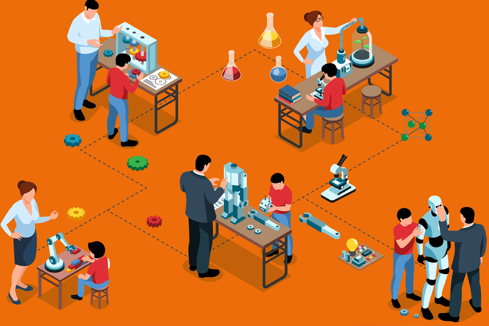

#  中小学STEM教育辅助系统

**STEM 教育：培养未来创新者的跨学科教育范式**

STEM 教育是科学（Science）、技术（Technology）、工程（Engineering）、数学（Mathematics）四门学科的融合式教育体系，它打破传统学科壁垒，以项目式学习（PBL）和问题解决为核心，培养学生的创新思维、实践能力与跨学科整合素养。在科技高速迭代的 21 世纪，STEM 教育已成为全球教育改革的核心方向，旨在为未来社会输送具备竞争力的复合型人才。
 

**加入 STEM 教育，解锁未来潜力**. 
 

无论是中小学生探索科学奥秘，还是大学生规划职业方向，亦或教育者寻求创新教学模式，STEM 教育都为你提供了一扇通往未来的窗口。在这里，知识不再是枯燥的公式，而是解决问题的钥匙；创新不再是遥不可及的概念，而是手可触及的实践。[我们的位置](https://emingyou.github.io/index/) 
 

**欢迎同学们前来学习！ have any information, please contact me. Thank you!**
 
---
 

## 为什么 STEM 教育如此重要？：
 
人工智能、气候变化、生物科技等全球性议题，需要跨学科人才运用综合知识提出解决方案。STEM 教育通过模拟真实场景的项目（如设计环保装置、编写智能程序），让学生在实践中掌握 “用科技解决问题” 的思维模式。
 
- 批判性思维：通过分析数据、验证假设，学会理性决策；
- 创新创造力：在工程设计、编程建模中突破常规，孕育新想法；
- 协作与沟通：团队合作完成项目时，锻炼跨学科沟通和资源整合能力；
- 适应力：面对技术快速更新，培养持续学习和解决复杂问题的能力。

 
 

---

## 全球STEM教育发展趋势：
 
 

- **从 K12 到终身学习：**：许多国家已将 STEM 纳入基础教育核心课程，如美国的 “Computer Science for All” 计划、中国的 “青少年科技创新大赛”。同时，成人教育中 STEM 技能培训（如数据分析、物联网应用）需求激增。
- **多元化与包容性：**越来越多项目致力于缩小性别、地域差距，鼓励女性、少数族裔参与 STEM 领域。例如，“Girls Who Code” 组织通过编程课程激发女孩对科技的兴趣。
- **融合人文与伦理：**现代 STEM 教育强调技术的人文关怀，如在人工智能教学中融入伦理讨论，确保技术创新服务于人类福祉。
- **加入 STEM 教育，解锁未来潜力：**无论是中小学生探索科学奥秘，还是大学生规划职业方向，亦或教育者寻求创新教学模式，STEM 教育都为你提供了一扇通往未来的窗口。在这里，知识不再是枯燥的公式，而是解决问题的钥匙；创新不再是遥不可及的概念，而是手可触及的实践。
 

- **让我们一起，用 STEM 思维定义未来！**循此苦旅，终抵群星
 

 

